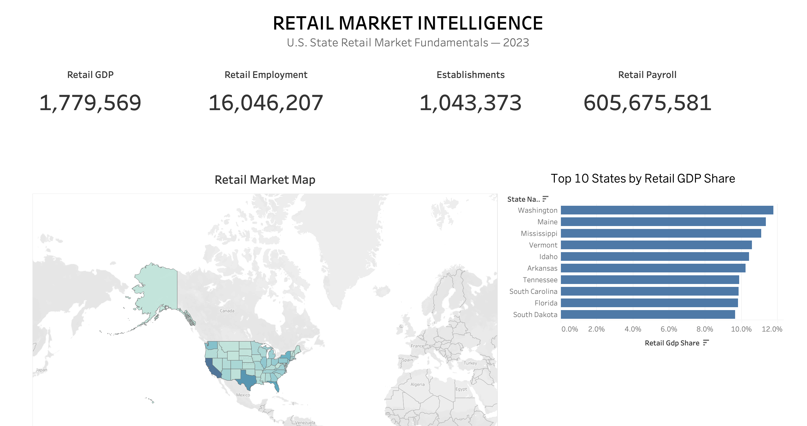

# U.S. Retail Market Intelligence System

An **Analytics Engineering portfolio project** using Snowflake, dbt, SQL, Python, and Tableau to transform U.S. government economic and business data into a tested, state-level retail-market analytical dataset.

## Business Question

> **Which U.S. states have the strongest retail-market fundamentals, and what measurable economic and business factors explain those differences?**

Retail-market strength cannot be evaluated effectively using a single metric. Retail employment, establishments, payroll, total state GDP, and Retail Trade GDP provide different perspectives on the size, economic importance, and productivity of retail activity.

This project integrates these measures into a consistent state-level analytical model.

---

## Project Objective

The objective is to build a reliable, analytics-ready data platform that combines multiple U.S. government datasets and transforms them into business-oriented retail-market metrics.

The project demonstrates how to:

* Integrate multiple public government datasets.
* Load and preserve source data in Snowflake.
* Build a layered dbt transformation pipeline.
* Standardize geographic identifiers and data types.
* Transform source-specific data into reusable business concepts.
* Maintain a defined **State × Year** analytical grain.
* Apply automated data-quality testing.
* Create analysis-ready metrics and rankings.
* Deliver a Tableau dashboard for business-facing analysis.

The project demonstrates an end-to-end **Analytics Engineering workflow from raw data to business intelligence**.

---

## Dashboard

The final analytical output is presented in a Tableau dashboard covering U.S. retail-market fundamentals for 2023.

[

The dashboard presents:

* Retail GDP
* Retail employment
* Retail establishments
* Annual retail payroll
* Retail GDP share of state GDP
* Retail GDP per employee
* State-level rankings
* Geographic distribution of retail-market metrics

---

## Architecture

The project uses a layered Analytics Engineering architecture:

```text
Government Data Sources
        │
        ▼
   Snowflake RAW
        │
        ▼
    dbt STAGING
        │
        ▼
 dbt INTERMEDIATE
        │
        ▼
     dbt MARTS
        │
        ▼
   dbt ANALYTICS
        │
        ▼
   Analytics CSV
        │
        ▼
   Tableau Dashboard
```

### Layer Responsibilities

| Layer            | Purpose                                                                                                                      |
| ---------------- | ---------------------------------------------------------------------------------------------------------------------------- |
| **RAW**          | Preserves the original government source data in Snowflake.                                                                  |
| **STAGING**      | Cleans and standardizes source-specific data, including column names, data types, geographic identifiers, and source values. |
| **INTERMEDIATE** | Applies reusable business transformations and integrates related datasets into business concepts.                            |
| **MARTS**        | Produces curated, business-ready datasets at a consistent State × Year grain.                                                |
| **ANALYTICS**    | Creates analysis-ready metrics and rankings used to answer the business question.                                            |
| **Tableau**      | Presents the final analytical results through an interactive dashboard.                                                      |

### Design Principles

The project follows several Analytics Engineering principles:

* **Separation of concerns** — source cleaning, business logic, modeling, and analytical calculations are separated into different layers.
* **Modular transformations** — business logic is divided into reusable dbt models.
* **Defined grain** — the final marts and analytics model use a State × Year grain.
* **Source preservation** — raw government data is preserved before transformation.
* **Tested transformations** — dbt tests validate data integrity and business rules.
* **BI-ready outputs** — the Analytics layer provides a stable interface for Tableau and other analytical tools.

---

## Data Sources

The project uses four government datasets from the U.S. Census Bureau and U.S. Bureau of Economic Analysis (BEA).

| Source                           | Dataset                                                                     | File                                           | Purpose                                        |
| -------------------------------- | --------------------------------------------------------------------------- | ---------------------------------------------- | ---------------------------------------------- |
| U.S. Census Bureau               | American Community Survey 2024 5-Year Estimates — State Comparison Profiles | `ACS_2024_5Year_State_Comparison_Profiles.csv` | State population and demographic context       |
| U.S. Census Bureau               | County Business Patterns 2023 — State File                                  | `cbp23st.csv`                                  | Retail establishments, employment, and payroll |
| U.S. Bureau of Economic Analysis | State Quarterly GDP Summary (SQGDP1)                                        | `SQGDP1__ALL_AREAS_2005_2026.csv`              | Total state GDP                                |
| U.S. Bureau of Economic Analysis | GDP by State (SQGDP2)                                                       | `SQGDP2__ALL_AREAS_2005_2026.csv`              | Retail Trade GDP and industry-level GDP        |

### Official Data Sources

* [U.S. Census Bureau — American Community Survey](https://www.census.gov/data/developers/data-sets/acs-5year/2024.html)
* [U.S. Census Bureau — County Business Patterns](https://www.census.gov/data/datasets/2023/econ/cbp/2023-cbp.html)
* [U.S. Bureau of Economic Analysis — Interactive Data](https://www.bea.gov/itable)

---

## Data Preparation

The raw source files are preserved in Snowflake rather than manually modifying the original CSV files.

Key preparation activities include:

* Standardizing state and geographic identifiers.
* Cleaning quoted and inconsistent FIPS codes.
* Converting source fields to appropriate analytical data types.
* Preserving Census suppression and status codes.
* Handling suppressed or unavailable values without treating them as zero.
* Filtering BEA datasets to the required geographic and industry records.
* Reshaping quarterly GDP data into an analytical structure.
* Calculating annual GDP from quarterly observations.
* Aligning datasets to a common state and year grain.

---

# Data Transformation

## 1. Staging

The staging layer creates a clean and standardized representation of the raw Snowflake data.

Staging models were created for:

* ACS
* County Business Patterns
* SQGDP1
* SQGDP2

The staging layer performs **source-specific cleaning and standardization**, including:

* Column naming
* Data-type conversion
* Geographic identifier cleaning
* Source-specific filtering
* Basic value standardization

The staging layer intentionally stays close to the source data. Business joins and major business transformations are handled downstream in the intermediate layer.

---

## 2. Intermediate

The intermediate layer converts cleaned source data into reusable business concepts.

Examples include:

* Aggregating retail NAICS industries.
* Calculating state-level retail establishments, employment, and payroll.
* Transforming quarterly GDP data into annual measures.
* Separating total state GDP from Retail Trade GDP.
* Standardizing geographic identifiers across datasets.
* Integrating retail business activity with economic data.
* Calculating derived productivity metrics.

### Intermediate Model Grain

| Model                  | Grain                        |
| ---------------------- | ---------------------------- |
| `int_acs_state`        | State × Year                 |
| `int_cbp_retail`       | State × 6-digit NAICS × Year |
| `int_cbp_retail_state` | State × Year                 |
| `int_retail_business`  | State × Year                 |
| `int_sqgdp1_total`     | State × Year                 |
| `int_sqgdp2_retail`    | State × Year                 |
| `int_retail_market`    | State × Year                 |

The `int_cbp_retail` model retains the detailed **State × 6-digit NAICS × Year** grain before the retail industries are aggregated to the state level.

---

## 3. Marts

The marts layer creates curated, business-ready datasets for downstream analytical use.

### Mart Grain

The mart models use a consistent:

**State × Year**

grain.

| Model                      | Grain        | Purpose                               |
| -------------------------- | ------------ | ------------------------------------- |
| `mart_retail_state`        | State × Year | State-level retail business activity  |
| `mart_retail_market_state` | State × Year | Integrated retail-market fundamentals |

The marts contain the business measures needed for analysis, including:

* Retail establishments
* Retail employment
* Retail annual payroll
* Total state GDP
* Retail Trade GDP
* Retail GDP share
* Retail employment per establishment
* Retail payroll per employee
* Retail GDP per establishment
* Retail GDP per retail employee

The marts provide a stable business-friendly interface between transformation logic and downstream analytics.

---

# Analytics Model

The final analytical model is:

```text
analytics_retail_market_state
```

### Grain

**One row per State × Year**

### Purpose

The Analytics layer transforms the curated mart data into metrics and rankings that directly support the business question.

### Final Analytical Columns

| Column                                | Description                                    |
| ------------------------------------- | ---------------------------------------------- |
| `STATE_FIPS`                          | State FIPS geographic identifier               |
| `STATE_NAME`                          | State name                                     |
| `YEAR`                                | Data year                                      |
| `RETAIL_ESTABLISHMENTS`               | Total retail establishments                    |
| `RETAIL_EMPLOYMENT`                   | Total retail employment                        |
| `RETAIL_ANNUAL_PAYROLL`               | Total annual retail payroll                    |
| `TOTAL_GDP_ANNUAL`                    | Total annual state GDP                         |
| `RETAIL_GDP_ANNUAL`                   | Annual Retail Trade GDP                        |
| `RETAIL_GDP_SHARE`                    | Retail Trade GDP as a share of total state GDP |
| `RETAIL_EMPLOYMENT_PER_ESTABLISHMENT` | Retail employment per establishment            |
| `RETAIL_PAYROLL_PER_EMPLOYEE`         | Annual retail payroll per employee             |
| `RETAIL_GDP_PER_ESTABLISHMENT`        | Retail GDP per establishment                   |
| `RETAIL_GDP_PER_RETAIL_EMPLOYEE`      | Retail GDP per retail employee                 |
| `RETAIL_GDP_SHARE_RANK`               | State ranking by retail GDP share              |
| `RETAIL_EMPLOYMENT_RANK`              | State ranking by retail employment             |
| `RETAIL_GDP_PER_EMPLOYEE_RANK`        | State ranking by retail GDP per employee       |

---

## Ranking Methodology

The Analytics layer calculates three independent rankings using SQL `RANK()` window functions.

### 1. Retail GDP Share

States are ranked by:

```sql
RANK() OVER (
    PARTITION BY YEAR
    ORDER BY RETAIL_GDP_SHARE DESC
)
```

This measures the **relative importance of Retail Trade within the state's overall economy**.

### 2. Retail Employment

States are ranked by:

```sql
RANK() OVER (
    PARTITION BY YEAR
    ORDER BY RETAIL_EMPLOYMENT DESC
)
```

This measures **retail-market scale in terms of employment**.

### 3. Retail GDP per Employee

States are ranked by:

```sql
RANK() OVER (
    PARTITION BY YEAR
    ORDER BY RETAIL_GDP_PER_RETAIL_EMPLOYEE DESC
)
```

This provides a measure of **retail economic output relative to the retail workforce**.

---

## Why Three Rankings?

The project deliberately keeps the rankings separate rather than creating a single composite score.

The three dimensions represent different analytical questions:

| Metric                      | Analytical Question                                        |
| --------------------------- | ---------------------------------------------------------- |
| **Retail GDP Share**        | How important is retail to the state's economy?            |
| **Retail Employment**       | How large is the state's retail workforce?                 |
| **Retail GDP per Employee** | How much retail economic output is generated per employee? |

Keeping these measures independent avoids introducing arbitrary weighting assumptions into the analytical model.

Users can therefore examine retail-market fundamentals from multiple perspectives.

---

## Annual Data Coverage

The source datasets contain different periods of data.

The current integrated analysis is limited to **2023** because the County Business Patterns retail business data used in the project is from 2023, while the BEA GDP datasets contain quarterly observations covering many years.

The integrated analysis therefore uses:

| Data Component           | Coverage Used         | Role                                           |
| ------------------------ | --------------------- | ---------------------------------------------- |
| ACS                      | 2024 5-Year Estimates | State population and demographic context       |
| CBP Retail               | 2023                  | Retail establishments, employment, and payroll |
| Total State GDP          | BEA quarterly data    | Annualized total state GDP for 2023            |
| Retail Trade GDP         | BEA quarterly data    | Annualized Retail Trade GDP for 2023           |
| Integrated Retail Market | 2023                  | Final state-level analysis                     |

### Annual GDP Calculation

Annual GDP is calculated from the four quarterly observations:

```text
Annual GDP = (Q1 + Q2 + Q3 + Q4) / 4
```

An annual value is calculated only when all four quarterly observations are available.

The current analytical output contains **51 state-level records for 2023**, representing the 50 U.S. states plus the District of Columbia.

The multi-year BEA data provides an opportunity for future expansion when comparable annual CBP retail business data is incorporated.

---

# Data Quality and Testing

Data quality is an integral part of the Analytics Engineering workflow.

The project uses dbt tests across the staging, intermediate, marts, and analytics layers.

### Testing Coverage

The project contains **68 data tests**, including:

* **Not-null tests** — Required fields contain values.
* **Unique tests** — Business keys and identifiers do not contain unexpected duplicates.
* **Accepted-values tests** — Fields contain expected values.
* **Relationship tests** — Related models maintain referential integrity.
* **Business-key validation** — Models maintain their intended grain and uniqueness.
* **Analytical validation** — Ranking outputs maintain the expected structure.

## Full Project Validation

The complete dbt project was validated using:

```bash
dbt build
```

Final validation:

| Validation             | Result |
| ---------------------- | -----: |
| dbt Models             |     14 |
| Data Tests             |     68 |
| Total Build Operations |     82 |
| Passed                 |     82 |
| Warnings               |      0 |
| Errors                 |      0 |
| Skipped                |      0 |

**Final result: 82/82 operations passed successfully.**

The project also uses `dbt docs generate` to generate documentation and a data catalog covering models, sources, columns, and relationships.

---

# Key Analytical Dimensions

The project evaluates retail-market fundamentals through several measurable dimensions rather than relying on one metric.

### Retail Market Scale

Measured through:

* Retail establishments
* Retail employment
* Retail annual payroll

### Economic Contribution

Measured through:

* Total state GDP
* Retail Trade GDP
* Retail GDP share of total state GDP

### Productivity

Measured through:

* Retail employment per establishment
* Retail payroll per employee
* Retail GDP per establishment
* Retail GDP per retail employee

These measures provide complementary views of retail-market structure and economic activity.

---

# Technology Stack

| Technology                    | Purpose                                                              |
| ----------------------------- | -------------------------------------------------------------------- |
| **Snowflake**                 | Cloud data warehouse for raw and transformed data                    |
| **dbt Core**                  | Data transformation, modeling, testing, and documentation            |
| **SQL**                       | Data cleaning, transformation, modeling, and analytical calculations |
| **Python**                    | Supporting data preparation and workflow tasks                       |
| **Tableau**                   | Business intelligence and visualization                              |
| **Git / GitHub**              | Version control and project documentation                            |
| **U.S. Government Open Data** | Source data from Census Bureau and BEA                               |

---

# Analytics Engineering Practices Demonstrated

This project demonstrates practical Analytics Engineering practices including:

* Layered data modeling
* STAGING → INTERMEDIATE → MARTS → ANALYTICS architecture
* Source preservation in Snowflake
* Modular dbt models
* Defined analytical grain
* SQL-based business transformations
* Data-quality testing
* Referential integrity testing
* Business-key validation
* Analytical validation
* dbt documentation and lineage
* Separation of transformation from visualization
* BI-ready analytical outputs
* Version-controlled development with Git

---

# Project Outcome

The completed project transforms multiple U.S. government datasets into a unified state-level retail-market analytical model.

The workflow demonstrates the ability to:

1. Identify and assess appropriate public data sources.
2. Load raw data into Snowflake.
3. Build a layered dbt transformation pipeline.
4. Create reusable Staging, Intermediate, Marts, and Analytics models.
5. Maintain a defined analytical grain.
6. Apply automated data-quality testing.
7. Build business-oriented analytical metrics.
8. Produce an analytics-ready dataset.
9. Deliver a Tableau dashboard.
10. Connect raw public data to business-facing analytics.

The final result is a reproducible **Analytics Engineering workflow connecting raw government data to tested analytical models and business intelligence**.

This portfolio project demonstrates practical skills in:

**SQL · Snowflake · dbt · Data Modeling · Data Quality · Analytics Engineering · Python · Tableau · Git**
